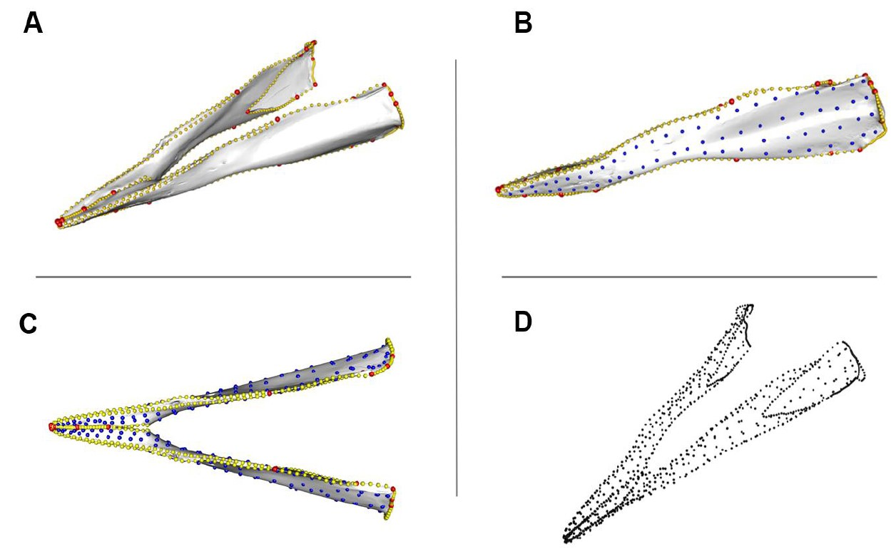

#Drivers of morphological evolution<br> #in the toothed whale jaw



<sup>Image: Landmark, curve, and surface patch point protocol. 
A. Landmarks and curves. 
B. Landmarks, curves, and patch points - lateral. 
C. Landmarks, curves, and patch points - dorsal. 
D. Landmarks, curves, and patch points with no mesh. 
Mesh shown is _Mesoplodon ginkgodens_ USNM 298237</sup>


__Authors:__

[Ellen J. Coombs](mailto:coombse@si.edu), 
Andrew Knapp, 
[Travis Park](https://github.com/travispark),
Rebecca F. Bennion,
Matthew R. McCurry,
[Agnese Lanzetti](https://github.com/AgneseLan),
Robert R. Boessenecker, 
Michael R. McGowen 

__To cite the paper__: 

>Coombs EJ, Knapp A, Park T, Bennion RF, McCurry M, Lanzetti A, Boessenecker RW, McGowen MR. Drivers of morphological evolution in the toothed whale jaw. Current Biology. 2023. 
Details available at: https://github.com/EllenJCoombs/Odontocete_mandible_evolution

If using any of this code or data please cite the paper above and this repo

__To cite this repo__: 

Github: https://github.com/EllenJCoombs/Odontocete_mandible_evolution


## Data :bar_chart: :chart_with_downwards_trend: 

The data are provided in the `data` folder
1. `Csize.csv`- centroid size for all taxa
2. `Regions_mandibles_patches.csv` - Landmarks, curves, and patches
3. `Table S1` - MANOVA results for ecological influences on mandible morphology in cetaceans
4. `Table S2` - All species data and ecological data
5. `Table S3` - Description of landmarks placed on each specimen
6. `Table S4` - Description of landmarks and curves placed on each specimen


## Analysis :chart_with_upwards_trend:
In this repository you will find raw data (.csv and .xlsx files) and code for analyses (code supplied as .R files)

 :file_folder:
* **data**

As above 

 :file_folder:
* **code**

`Asymmetry_LHS_RHS.R`

`BT_MCMC.R`

`BT_to_tree.R`

`Binary_ASCII_ply.R`

`Eco_morphospace.R`

`Import_resample_slide_LMs.R`

`Rates_eco_mnVMORPH.R`

`Slider3d_2.R`


## License :page_with_curl:
This project is licensed under the MIT License - see the [LICENSE.md](https://github.com/EllenJCoombs/Odontocete_mandible_evolution/blob/main/LICENSE) file for details

## Session Info :clipboard:
For reproducibility purposes, here is the output of `devtools::session_info()` used to perform the analyses in the publication. 

```{r}
R version 4.3.0 (2023-04-21 ucrt)
Platform: x86_64-w64-mingw32/x64 (64-bit)
Running under: Windows 11 x64 (build 22621)

Matrix products: default

locale:
[1] LC_COLLATE=English_United Kingdom.1252  LC_CTYPE=English_United Kingdom.1252    LC_MONETARY=English_United Kingdom.1252
[4] LC_NUMERIC=C                            LC_TIME=English_United Kingdom.1252    

attached base packages:
[1] stats     graphics  grDevices utils     datasets  methods   base     

loaded via a namespace (and not attached):
 [1] nlme_3.1-137            fs_1.3.1                usethis_2.0.0           RRPP_0.6.1              devtools_2.3.2         
 [6] rprojroot_1.3-2         numDeriv_2016.8-1.1     tools_3.5.0             backports_1.2.1         utf8_1.1.4             
[11] R6_2.5.0                DBI_1.1.0               lazyeval_0.2.2          colorspace_1.4-1        manipulateWidget_0.9.0 
[16] withr_2.3.0             tidyselect_1.1.0        gridExtra_2.3           prettyunits_1.1.1       mnormt_1.5-5           
[21] processx_3.4.5          phangorn_2.5.5          compiler_3.5.0          cli_2.2.0               animation_2.6          
[26] expm_0.999-4            desc_1.2.0              scales_1.0.0            quadprog_1.5-8          callr_3.5.1            
[31] pbapply_1.4-2           digest_0.6.27           jpeg_0.1-8              pkgconfig_2.0.3         htmltools_0.4.0        
[36] sessioninfo_1.1.1       plotrix_3.7-6           maps_3.3.0              htmlwidgets_1.5.1       rlang_0.4.10           
[41] rstudioapi_0.11         shiny_1.0.5             generics_0.1.0          combinat_0.0-8          jsonlite_1.7.1         
[46] crosstalk_1.0.0         gtools_3.5.0            dplyr_1.0.6             magrittr_2.0.1          Matrix_1.2-14          
[51] Rcpp_1.0.6              munsell_0.5.0           fansi_0.4.2             ape_5.3                 lifecycle_1.0.0        
[56] scatterplot3d_0.3-41    clusterGeneration_1.3.4 MASS_7.3-49             pkgbuild_1.2.0          grid_3.5.0             
[61] parallel_3.5.0          BTRTools_0.0.0.9000     promises_1.0.1          crayon_1.3.4            miniUI_0.1.1           
[66] geomorph_3.3.1          lattice_0.20-35         knitr_1.28              ps_1.3.2                pillar_1.6.0           
[71] igraph_1.2.4.1          pkgload_1.1.0           fastmatch_1.1-0         glue_1.4.2              remotes_2.2.0          
[76] BiocManager_1.30.10     vctrs_0.3.8             treeio_1.6.2            httpuv_1.4.1            testthat_2.3.2         
[81] gtable_0.3.0            purrr_0.3.4             assertthat_0.2.1        ggplot2_3.3.2           xfun_0.12              
[86] mime_0.5                xtable_1.8-2            phytools_0.6-99         tidytree_0.3.3          coda_0.19-1            
[91] later_0.7.1             tibble_3.0.1            rvcheck_0.1.8           tinytex_0.20            memoise_1.1.0          
[96] rgl_0.100.54            ellipsis_0.3.1         
> 
```
